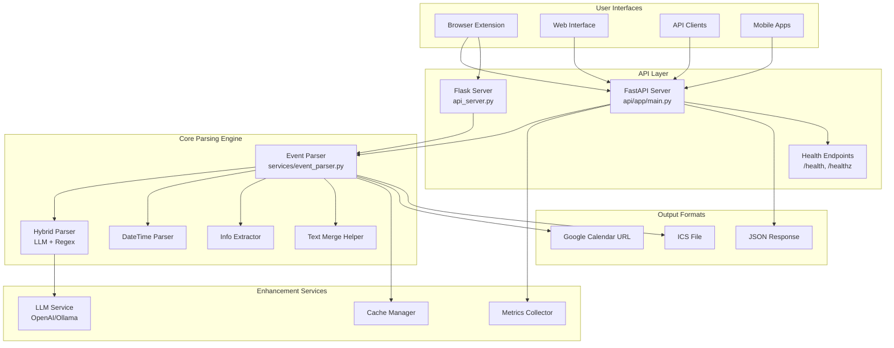
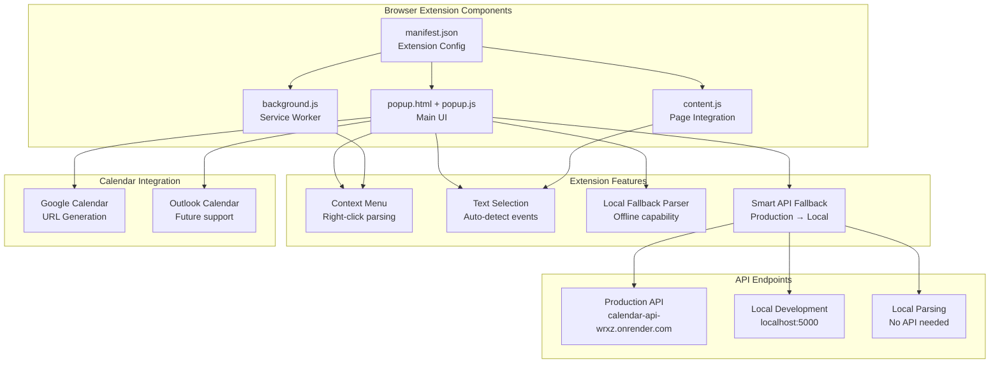
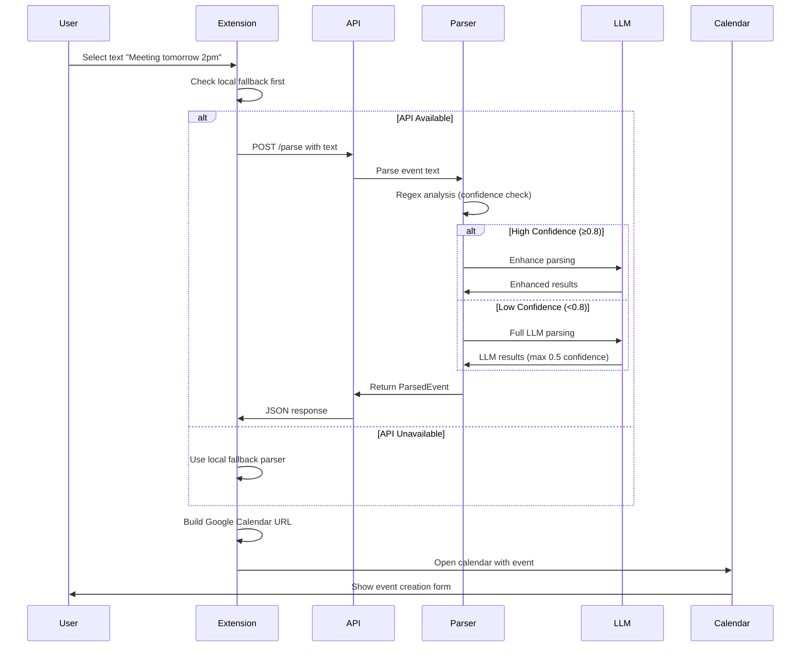
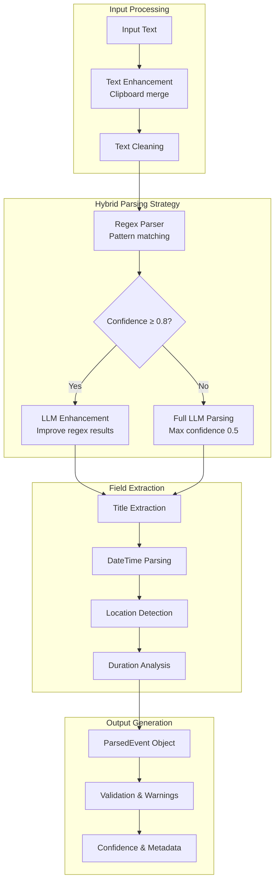
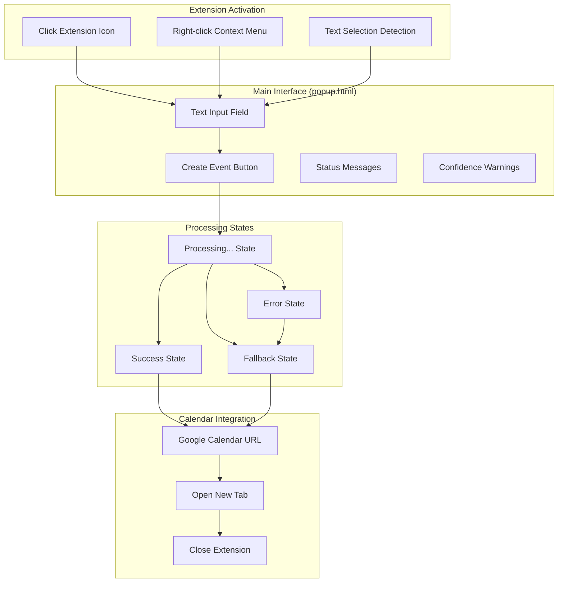

# Text-to-Calendar Event System - Architecture Schema

## System Overview



## Browser Extension Architecture



## Data Flow Architecture



## Browser Extension File Structure

```
browser-extension/
├── manifest.json              # Extension configuration
├── popup.html                 # Main UI interface
├── popup.js                   # Main logic & API calls
├── background.js              # Service worker for context menus
├── content.js                 # Page content interaction
├── config.js                  # Configuration settings
├── icons/                     # Extension icons
│   ├── icon16.png
│   ├── icon48.png
│   └── icon128.png
└── test-*.html                # Testing interfaces
```

## API Endpoints Schema

```mermaid
graph LR
    subgraph "FastAPI Endpoints"
        ROOT[GET / <br/>Health check]
        PARSE[POST /parse<br/>Main parsing]
        HEALTH[GET /health<br/>Detailed status]
        HEALTHZ[GET /healthz<br/>Simple probe]
        METRICS[GET /metrics<br/>Prometheus metrics]
        CACHE[GET /cache/stats<br/>Cache statistics]
    end
    
    subgraph "Flask Endpoints (Legacy)"
        FLASK_PARSE[POST /parse<br/>Simple parsing]
        FLASK_HEALTH[GET /health<br/>Basic health]
    end
    
    subgraph "Request/Response Format"
        REQ[Request:<br/>{text, timezone, locale, use_llm_enhancement}]
        RESP[Response:<br/>{title, start_datetime, end_datetime, location, confidence_score}]
    end
    
    PARSE --> REQ
    REQ --> RESP
    FLASK_PARSE --> REQ
```

## Parsing Pipeline Architecture



## Browser Extension UI Flow



## Key Features Summary

### Browser Extension Features
- **Smart API Fallback**: Tries production API → local API → offline parsing
- **Local Fallback Parser**: Works without any API connection
- **Context Menu Integration**: Right-click to parse selected text
- **Confidence Warnings**: Alerts users when parsing confidence is low
- **Google Calendar Integration**: Direct URL generation for event creation

### API Features
- **Hybrid Parsing**: Combines regex and LLM for optimal accuracy
- **Concurrent Processing**: Async field extraction for better performance
- **Caching System**: Reduces API calls and improves response times
- **Health Monitoring**: Multiple health check endpoints for deployment
- **Rate Limiting**: Prevents API abuse with configurable limits

### Parsing Engine Features
- **Multi-format Support**: Handles various date/time formats
- **Confidence Scoring**: Provides reliability metrics for each field
- **Text Enhancement**: Smart merging with clipboard content
- **Validation System**: Checks for common parsing errors
- **Metadata Tracking**: Detailed information about parsing decisions

This architecture provides a robust, scalable system for converting natural language text into structured calendar events with multiple fallback mechanisms and comprehensive error handling.